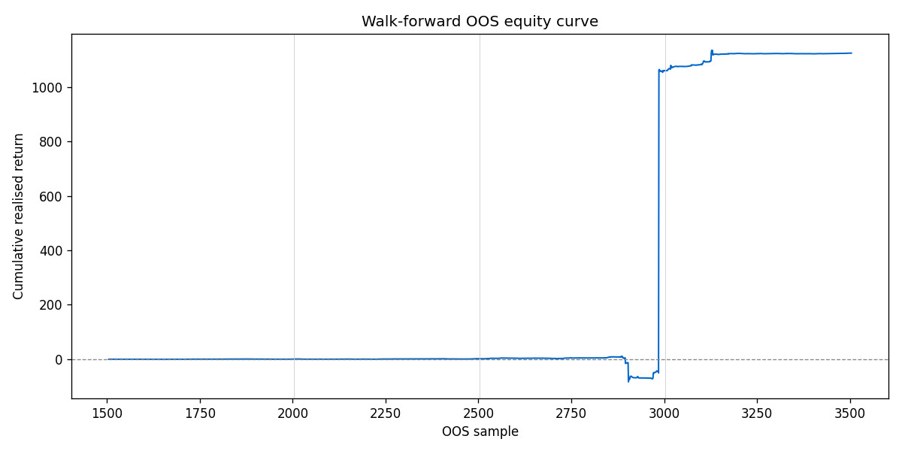

# Phase 6 walk-forward CV — sample report

_Generated for 4 folds._

## Per-fold metrics

| fold | n_train | n_test | test_start | test_end | log_loss | accuracy | auc | hit_rate | sharpe | max_drawdown | trade_count |
| --- | --- | --- | --- | --- | --- | --- | --- | --- | --- | --- | --- |
| 0 | 1500 | 500 | 1505 | 2005 | 0.7094 | 0.5080 | 0.5223 | 0.5080 | 0.7282 | -0.8471 | 500 |
| 1 | 1500 | 500 | 2005 | 2505 | 0.7099 | 0.5360 | 0.5388 | 0.5360 | 0.7204 | -1.1123 | 500 |
| 2 | 1500 | 500 | 2505 | 3005 | 0.7086 | 0.5660 | 0.5418 | 0.5660 | 0.6734 | -93.6350 | 500 |
| 3 | 1500 | 500 | 3005 | 3505 | 0.6946 | 0.5580 | 0.5978 | 0.5580 | 1.1173 | -17.0449 | 500 |

## Aggregate (mean ± std across folds)

| metric | mean ± std |
| --- | --- |
| n_train | 1500.0000 ± 0.0000 |
| n_test | 500.0000 ± 0.0000 |
| train_start | 750.0000 ± 559.0170 |
| train_end | 2250.0000 ± 559.0170 |
| test_start | 2255.0000 ± 559.0170 |
| test_end | 2755.0000 ± 559.0170 |
| log_loss | 0.7056 ± 0.0064 |
| accuracy | 0.5420 ± 0.0225 |
| auc | 0.5502 ± 0.0285 |
| hit_rate | 0.5420 ± 0.0225 |
| sharpe | 0.8098 ± 0.1788 |
| max_drawdown | -28.1598 ± 38.3669 |
| trade_count | 500.0000 ± 0.0000 |

## Equity curve (concatenated OOS)

## Feature importance (mean gain across folds)

| feature | mean_gain | std_gain | n_folds |
| --- | --- | --- | --- |
| edge | 3.5178 | 0.2075 | 4 |
| noise | 2.7886 | 0.1466 | 4 |
| momentum | 2.7404 | 0.1624 | 4 |

## Leakage sanity panel

**PASS** — synthetic future-leak fixture across 10 folds. min accuracy = 0.9800, min AUC = 0.9996 (threshold ≥ 0.95).
